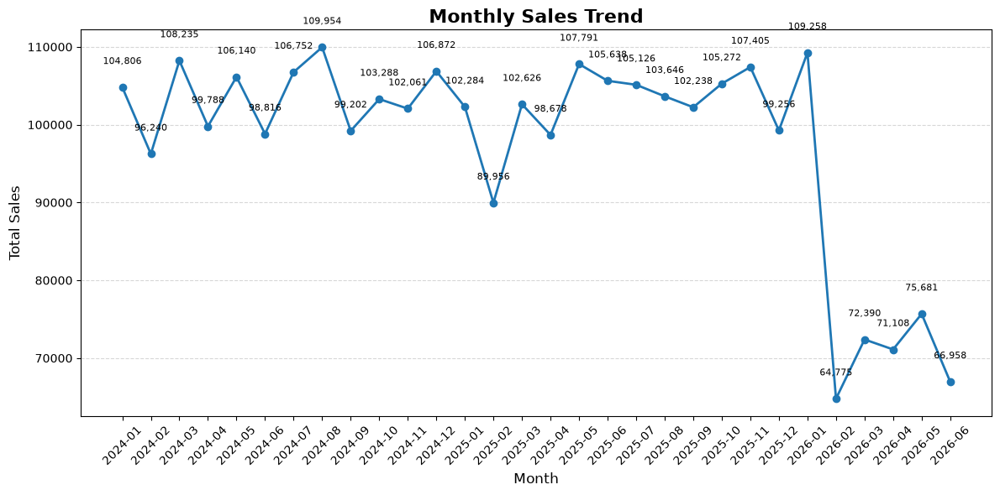
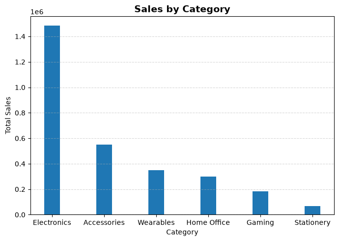
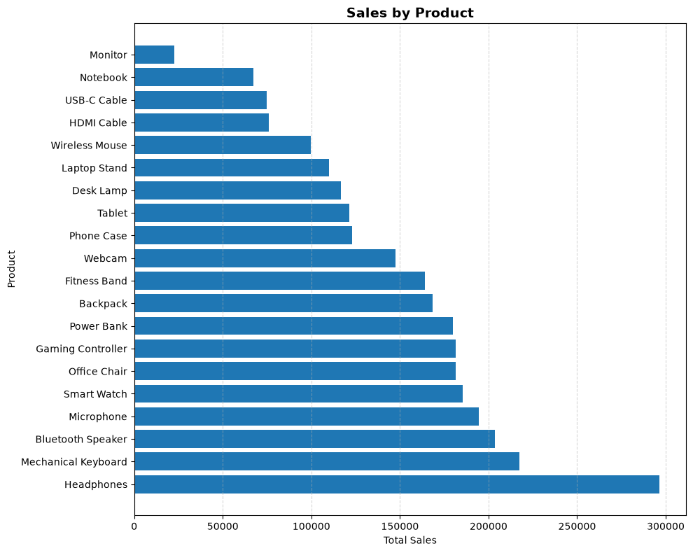
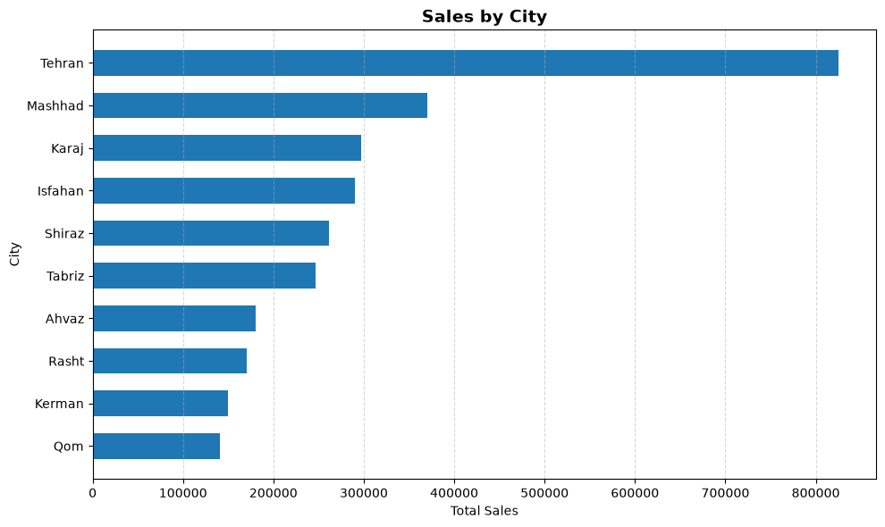
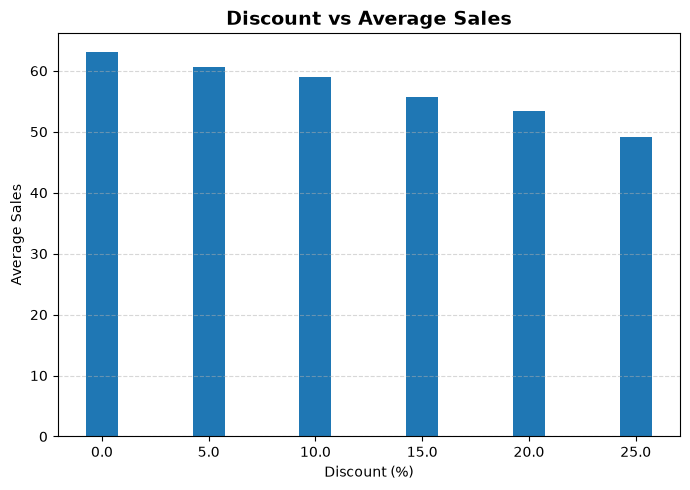
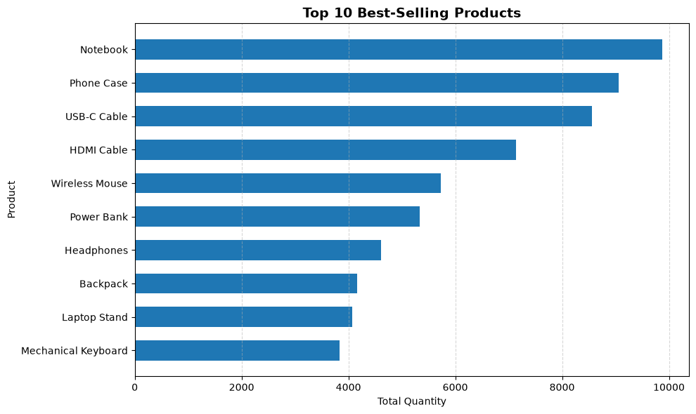
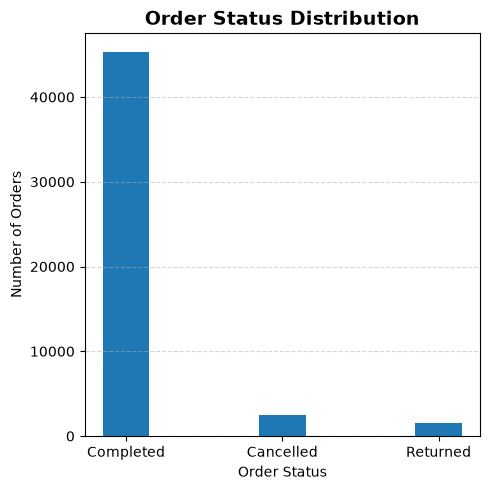

# E-commerce Sales Analysis

## Project Overview

This project analyzes e-commerce sales data to understand sales performance, customer behavior, discounts, products, and order status.

The project includes data cleaning, exploratory data analysis, visualizations, business insights, and recommendations.

## Dataset

The dataset contains 49,222 orders with information about:

- Orders
- Customers
- Products
- Sales
- Quantity
- Discounts
- Cities
- Customer segments
- Payment methods
- Order status

### Dataset Versions

- **Raw Dataset:** `data/raw/Dataset.csv`
- **Cleaned Dataset:** `data/processed/cleaned_ecommerce_sales.csv`

The raw dataset is kept separately to show the data **before cleaning**, while the processed dataset contains the cleaned version used for analysis.
## Data Cleaning

The cleaning process included:

* Checking missing values
* Checking duplicate rows
* Checking data types
* Converting date columns
* Checking categorical values
* Checking numerical values
* Handling unusual numerical values using IQR-based clipping

## Sales Analysis

The analysis covers:

* Total Sales
* Total Orders
* Total Quantity
* Average Order Value
* Monthly Sales
* Sales by Category
* Sales by Product

## Customer Analysis

The analysis includes:

* Total Customers
* Sales by City
* Average Customer Age
* Top Customers

## Discount Analysis

The project analyzes:

* Average Discount
* Discount levels and average sales

## Product Analysis

The project includes:

* Best-selling products by quantity
* Highest revenue products
* Low-selling products
* Revenue by category

## Order Status Analysis

Order statuses were analyzed based on:

* Number of orders
* Percentage of orders
* Sales by order status

## Visualizations

The project contains the following visualizations:

1. Monthly Sales Trend
2. Sales by Category
3. Sales by Product
4. Sales by City
5. Discount vs Average Sales
6. Top 10 Best-Selling Products
7. Order Status Distribution

### Monthly Sales Trend

### Sales by Category

### Sales by Product

### Sales by City

### Discount vs Average Sales

### Top 10 Best-Selling Products

### Order Status Distribution

## Key Business Insights

* Electronics generated the highest total sales among all categories.
* Notebook was the best-selling product by quantity.
* Headphones generated the highest total sales among products.
* Tehran generated the highest total sales among cities.
* Completed orders represented approximately 91.98% of all orders.
* The average discount across orders was approximately 7.29%.

## Recommendations

* Focus on the Electronics category.
* Maintain sufficient stock of Notebook.
* Give attention to Headphones.
* Support sales activities in Tehran.
* Monitor cancelled and returned orders for possible improvements.

## Technologies Used

* Python
* Pandas
* Matplotlib
* CSV
* Data Analysis
* Data Visualization

E-commerce Sales Analysis/
│
├── E-commerce Sales Analysis.py
├── README.md
│
├── data/
│   ├── raw/
│   │   └── Dataset.csv
│   │
│   └── processed/
│       └── cleaned_ecommerce_sales.csv
│
└── visualizations/
    ├── monthly_sales_trend.png
    ├── sales_by_category.png
    ├── sales_by_product.png
    ├── sales_by_city.png
    ├── discount_vs_average_sales.png
    ├── top_10_best_selling_products.png
    └── order_status_distribution.png